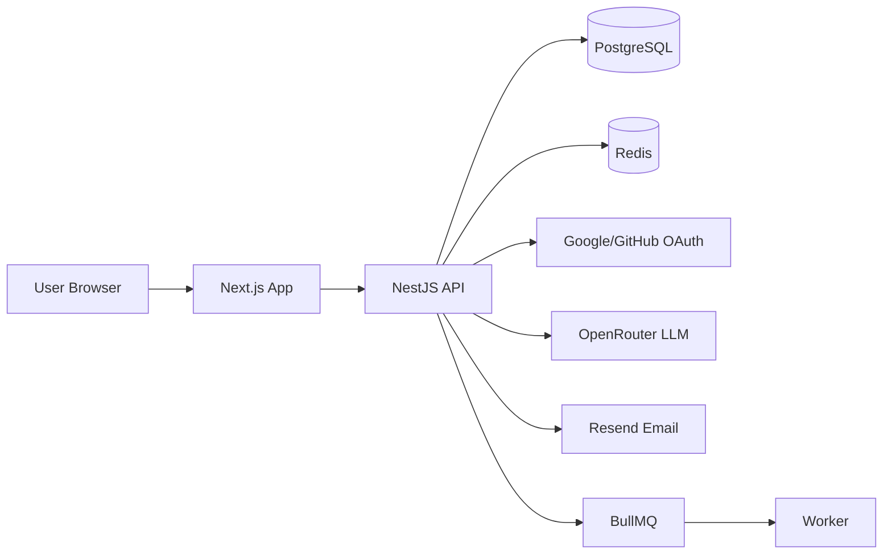

# PS Studio

PS Studio는 알고리즘 스터디를 그룹 단위로 운영하면서 과제, 제출, 코드 리뷰, 댓글, 알림, AI 분석을 한 흐름에서 관리하는 웹 플랫폼입니다.

## 구성

- `fe`: Next.js 프론트엔드
- `be`: NestJS API 서버
- `worker`: 백그라운드 작업 처리
- `packages/*`: 공용 패키지

## 아키텍처



## 로컬 실행

패키지 매니저는 `pnpm`을 사용합니다.

먼저 샘플 env 파일을 로컬 env 파일로 복사해서 시작하면 됩니다.

```bash
cp be/env.sample be/.env.local
cp fe/env.smaple fe/.env.local
```

```bash
pnpm install
pnpm dev
```

개별 실행도 가능합니다.

```bash
pnpm dev:fe
pnpm dev:be
pnpm dev:worker
```

Docker Compose로 로컬 스택을 띄울 수도 있습니다.

```bash
docker compose up -d
```

기본 포트는 다음과 같습니다.

- FE: `3000`
- BE: `4000`
- Postgres: `54322`
- Redis: `6379`

## 주요 스크립트

```bash
pnpm typecheck
pnpm lint
pnpm test
pnpm db:migrate
pnpm db:seed
```

## 배포

- 프로덕션 배포는 `docker-compose.prod.yml` 기준으로 동작합니다.
- GitHub Actions가 `main` 브랜치 푸시를 트리거로 이미지 빌드와 배포를 수행합니다.

## 참고

- 설계 문서는 `design/` 아래에 있습니다.
- 인프라·개발 가이드는 `playbook/` 아래에 있습니다.
