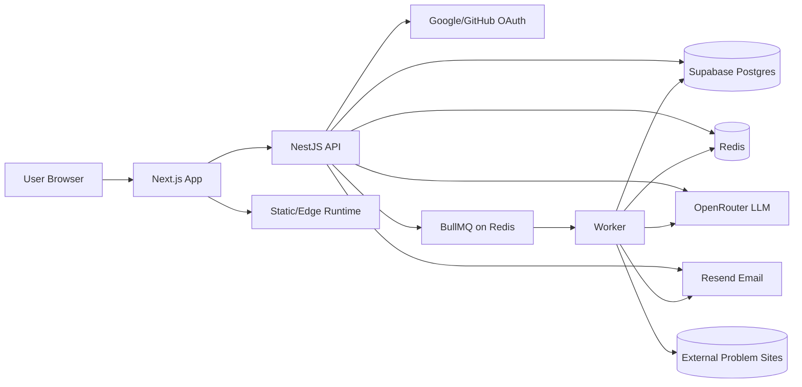
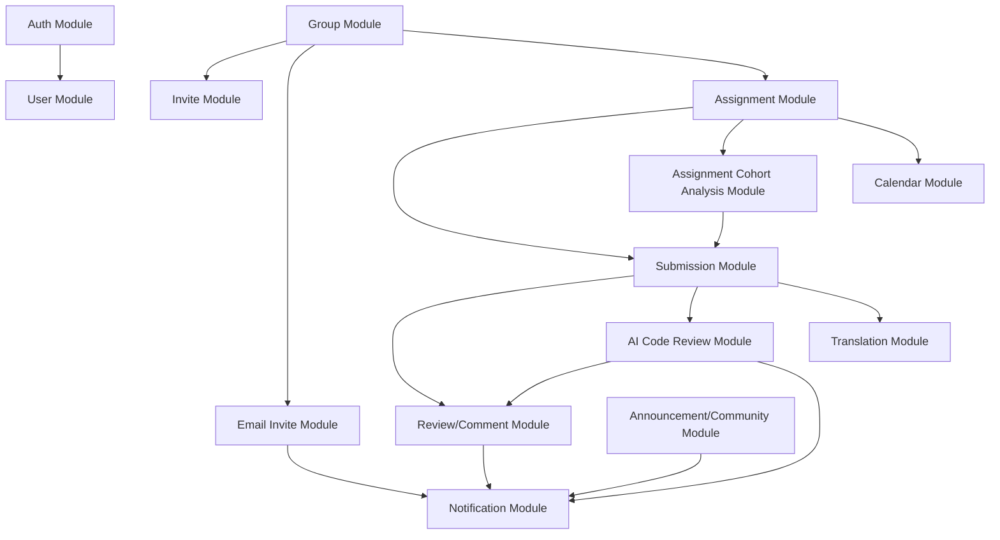
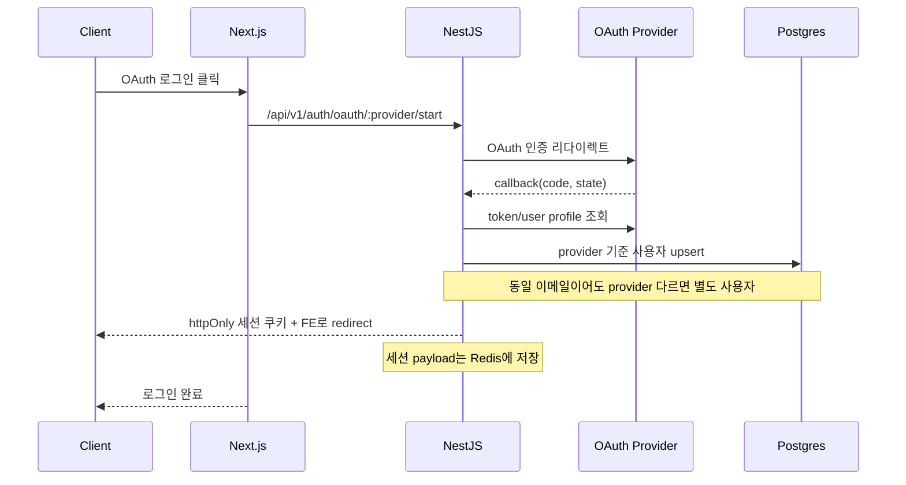
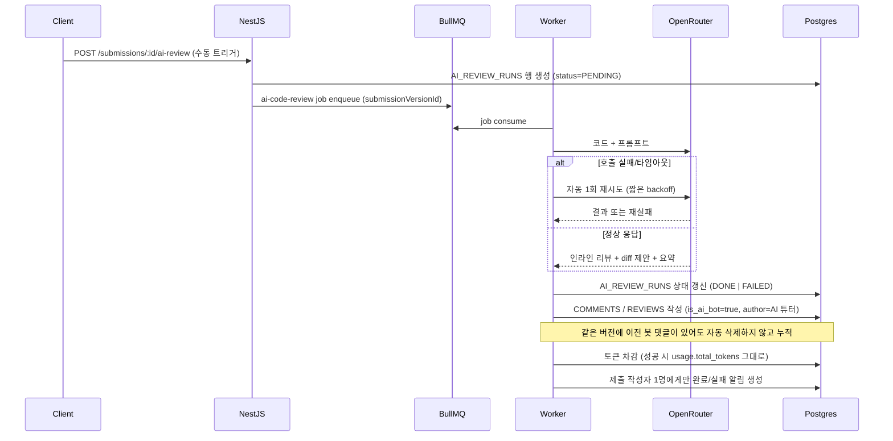
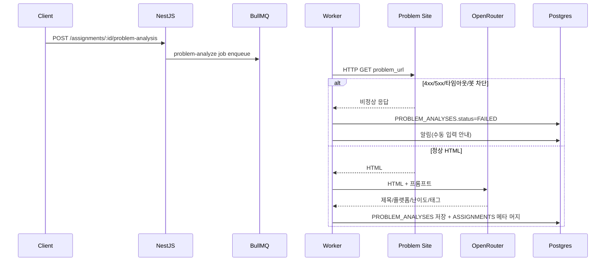
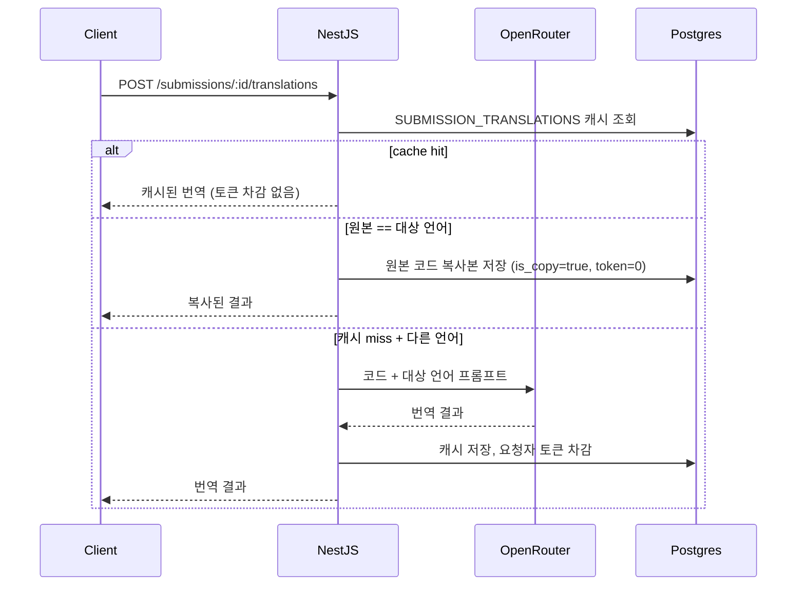
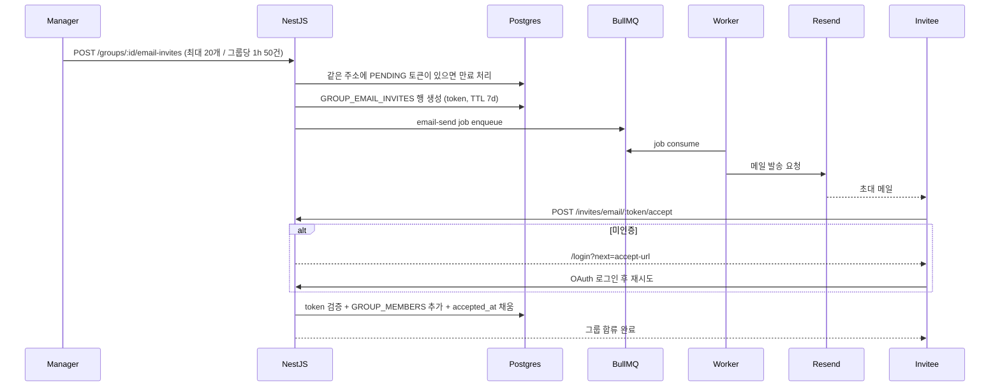
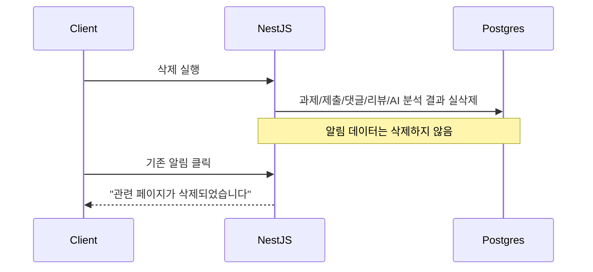

# Architecture (mermaid)

> `design/design.md` 확정 정책 기반의 1차 시스템 아키텍처입니다.

## 1. 시스템 개요

- Frontend: Next.js(App Router, Server Component 기본 + 필요한 Client Component)
- Backend: NestJS API
- DB: Supabase(PostgreSQL), Redis(캐시/큐/락)
- Local Infra: Docker Compose(`fe`, `be`, `worker`, `supabase`, `redis`)
- Deploy Infra: 추후 배포 시 Vercel/GCP/관리형 Supabase 등으로 분리 가능
- AI: 외부 LLM API(OpenRouter)로 문제 분석, AI 코드 리뷰, 코드 번역을 비동기로 처리하고 토큰 차감 정책을 적용
- Email: Resend API로 그룹 이메일 초대 메시지 발송(이메일은 그룹 초대 외 용도로 사용하지 않음)

## 1.1 로컬 Docker Compose 구성

로컬 개발의 기본 실행 단위는 다음 5개 논리 서비스입니다.

- `fe`: Next.js 개발 서버, 기본 포트 `3000`.
- `be`: NestJS API 서버, 기본 포트 `4000`.
- `worker`: AI 분석과 알림 백그라운드 작업.
- `supabase`: 로컬 개발용 Supabase Postgres 호환 DB, 호스트 포트 `54322`.
- `redis`: 큐, 작업 상태, 알림 카운트, 락, 호스트 포트 `6379`.

공식 Supabase 전체 로컬 스택은 내부 컨테이너가 많으므로 앱 Compose에 직접 포함하지 않습니다. Supabase Cloud 또는 Supabase CLI 스택을 사용할 때는 앱의 `DATABASE_URL`, `SUPABASE_DB_URL` 계열 환경변수를 해당 환경으로 교체합니다.

### 1.2 로컬 DB·Redis 데이터 보존(초기화 방지)

앱은 ORM `synchronize: false`로 **자동 드롭/재생성을 하지 않습니다.** 데이터가 “날아가는” 경우는 대부분 **인프라·명령** 쪽입니다.

- **Docker 볼륨 삭제 금지(로컬 DB·세션)**: `docker compose down -v` 또는 `-v`가 붙는 down은 `supabase-data`·`redis-data` 볼륨을 지워 **Postgres·Redis 데이터가 통째로 사라집니다.** 볼륨을 유지하려면 `docker compose down`만 쓰거나, `-v` 없이 스택만 내립니다.
- **`DATABASE_URL` 고정**: `be/.env.local`의 DB 접속 URL을 바꾸면 “다른 빈 DB”에 붙는 것과 같아서 그룹·멤버십이 비어 보일 수 있습니다. 팀/기기 간에도 동일 인스턴스를 가리키는지 확인합니다.
- **마이그레이션 되돌리기**: `pnpm db:revert`는 스키마를 이전 마이그레이션 상태로 되돌립니다. 실수 방지를 위해 스크립트는 **`ALLOW_DB_REVERT=1`** 이 없으면 실행하지 않습니다. 정말 필요할 때만 `ALLOW_DB_REVERT=1 pnpm db:revert` 형태로 실행합니다.
- **Redis**: 세션은 Redis에만 있습니다. Redis 볼륨/데이터가 초기화되면 로그인만 풀리고, **그룹 데이터(Postgres)는 그대로**일 수 있습니다.

## 2. 상위 아키텍처 다이어그램

## 3. 레이어별 책임

### 3.1 Frontend (Next.js)

- 공개 마케팅 랜딩 `/landing`(인증 불필요, SEO 메타·JSON-LD, `psstudio.locale` 쿠키와 맞춘 메타·JSON-LD 언어, i18n 본문, `fe/app/landing/mock` 전용 CSS로 실제 화면과 스타일 분리)
- 그룹/과제/제출/리뷰/알림/캘린더 UI 렌더링
- 그룹 대시보드 UI 렌더링(기간 필터, 꺾은선 그래프, 원형 그래프, 멤버/과제 통계)
- OAuth 로그인 진입 및 세션 기반 사용자 상태 관리
- ThemeProvider로 `system`, `light`, `dark` 테마 적용
- I18nProvider로 한국어/영어 UI 문자열 제공
  - `t(key, vars)`는 `{key}` 형태의 변수 치환을 지원합니다(`fe/src/i18n/I18nProvider.tsx`).
  - `AppShell`은 `titleKey`/`titleVars`/`subtitleKey`/`subtitleVars` props로 서버 페이지에서도 키 기반 번역을 사용할 수 있게 합니다.
  - UI 문자열은 코드/플랫폼/언어 이름을 제외하고 모두 `t()`로 통과시킵니다(하드코딩 한국어 금지).
- 테마와 언어 선택은 localStorage에 저장
- 그룹 탭 라우팅
  - `/groups`는 화면을 그리지 않고 서버에서 즉시 `redirect`합니다.
  - 가입 그룹 0개 → `/groups/explore` (그룹 둘러보기). 1개 이상 → `psstudio_last_group` 쿠키의 그룹 ID(없으면 첫 그룹)로 이동.
  - 그룹 상세 진입 시 `psstudio_last_group` 쿠키와 `localStorage("psstudio:lastGroupId")`를 동시에 갱신합니다.
  - 헤더 우측 액션 슬롯(`AppShell.actions`)에 “그룹 추가” 모달과 “그룹 둘러보기” 링크 버튼을 둡니다.
  - “그룹 추가” 모달(`AddGroupModal`)은 새 그룹 만들기와 초대 코드 입력을 같이 노출합니다.
- diff 화면에서 현재 선택 버전 + 현재 버전 인라인 댓글만 표시
- 댓글·리뷰는 GitHub 스타일 공통 카드(`fe/src/ui/comments/CommentCard.tsx`)로 렌더링하고, 답글·이모지 반응을 동일하게 지원합니다.
- diff 인라인 리뷰 카드는 접기 가능하며, 접힌 상태에서는 작성자 아바타 칩과 답글 `+N` 카운트만 표시합니다.
- 다중 라인 범위 리뷰는 해당 new 라인 구간의 배경 음영(primary tint)만으로 시각화합니다(세로 strip 없음).
- 댓글 본문/마크다운 프리뷰의 fenced code block은 shiki로 토큰 단위 syntax highlighting을 적용합니다(`fe/src/ui/MarkdownCodeBlock.tsx`). 코드 블록 외곽 테두리는 한 겹으로 유지합니다.
- 모달 일관화
  - `fe/src/ui/Modal.tsx`/`Modal.module.css`를 표준으로 사용. 그라디언트/추가 그림자 없이 동일한 헤더·바디·푸터 패딩과 애니메이션을 사용합니다.
  - 삭제 확인은 `Modal` 푸터에 “취소(secondary) → 위험 액션(danger)” 순서를 유지합니다.
- 삭제 모달 표시 정책
  - 버튼 라벨 `삭제`
  - 과제 삭제 확인 문구 `삭제하시겠습니까?`

### 3.2 Backend (NestJS)

- 인증/인가(OWNER/MANAGER/MEMBER)
- 그룹/가입/과제/제출/리뷰/공지/커뮤니티 API
- Swagger UI와 OpenAPI JSON 제공(`/api-docs`, `/api-docs/json`)
- 그룹 규칙 단일 source(피드백 공개는 그룹원 모두 공개로 단순화)
- 그룹 코드 영구 토큰 + 그룹 코드 갱신 시 일괄 무효화
- 이메일 초대 1회용 토큰 발급 + Resend 호출
- 알림 이벤트 생성 및 읽음/삭제 처리
- AI 코드 리뷰/문제 분석/번역 작업 큐 발행 및 결과 저장(번역은 제출 버전 단위 캐시)
- 과제 집단 코드 비교 분석(마감 후·과제당 1회 성공) 인-프로세스 파이프라인 및 `ASSIGNMENT_COHORT_ANALYSES`·`report_locale`·`artifacts`(제출별 정규화 코드·역할 구역) 저장

### 3.3 Database (Supabase + Redis)

- Supabase: 트랜잭션 데이터 소스(권한, 과제, 제출, 리뷰, 알림, 게시판)
- Redis: 캐시, 큐, 분산락, 단기 집계 가속
- 알림은 TTL 없이 영구 보관(사용자 삭제 전)

### 3.4 Infra (Docker Compose 우선)

- Docker Compose: 로컬 개발 기본 실행 방식
- `fe`, `be`, `worker`, `supabase`, `redis` 5개 논리 서비스 유지
- Worker: AI 분석/재분석, 비동기 알림 후처리
- 장애 시 재시도/백오프 및 실패 알림 처리

## 4. 도메인 모듈 구조 (NestJS)

## 5. 핵심 시퀀스

### 5.1 OAuth 로그인

### 5.2 AI 코드 리뷰(수동 트리거, GitHub Bot 흐름)

AI 코드 리뷰는 자동 트리거를 두지 않습니다. 제출 작성자, 그룹장, 그룹 관리자가 명시적으로 "AI 리뷰 요청" 버튼을 눌러야 시작됩니다.

### 5.2.1 문제 URL 분석

### 5.2.2 코드 번역 캐시

### 5.2.3 이메일 초대

### 5.3 삭제와 알림 처리

## 6. 권한 매트릭스 요약

- 그룹장
  - 그룹 삭제 가능
  - 그룹 코드 갱신 가능(그룹 관리자 불가)
  - 그룹 탈퇴 불가
  - 그룹장 위임 가능
  - AI 봇 댓글·리뷰 삭제 가능
- 그룹 관리자
  - 그룹 삭제·그룹 코드 갱신 제외 대부분 운영 권한
  - 가입 신청 승인/거절(승인 시점에 정원 가득이면 거부)
  - 이메일 초대 발송(rate limit 적용)
  - AI 봇 댓글·리뷰 삭제 가능
- 그룹원
  - 제출/댓글/리뷰
  - 직접 그룹 탈퇴 가능
  - 그룹 코드 노출(공유 가능, 가입 토글 켜져 있을 때만 실제 합류 가능)
  - 번역 기능 트리거(같은 그룹 어떤 제출이든)
  - AI 코드 리뷰 트리거는 본인 제출에 한정(또는 그룹장/그룹 관리자)

## 7. 성능/운영 기준

- 제출 코드 최대 200KB 입력 제한
- 검색 기본 정렬 deadline 임박순
- 알림 unread count 빠른 조회 인덱스 구성
- diff/리뷰 조회는 버전 기준으로 페이지네이션
- AI 실패 시 재시도 후 실패 알림 발송

## 8. 보안/감사 기준

- 그룹 가입은 그룹 코드(영구) 또는 1회용 이메일 초대 토큰 또는 가입 신청을 통해서만 가능합니다. 공개 검색·외부 노출은 없습니다.
- 그룹 코드 갱신 시 이전 코드와 그것으로 만들어진 초대 링크는 즉시 무효화되며, 무효화된 토큰 접근은 `404`로 통일합니다.
- 가입 방식 토글이 모두 꺼지면 어떠한 신규 가입도 발생하지 않습니다.
- 멘션 대상은 같은 그룹원으로 제한합니다.
- 관리자 삭제는 soft-hidden(`삭제된 댓글입니다`) 정책을 유지합니다.
- AI 봇이 작성한 댓글·리뷰는 그룹장/그룹 관리자만 삭제할 수 있습니다.
- 과제 삭제자는 별도로 기록하지 않습니다.
- 외부 LLM과 Resend로 전송되는 데이터는 분석/발송에 필요한 최소 범위로 제한합니다.
